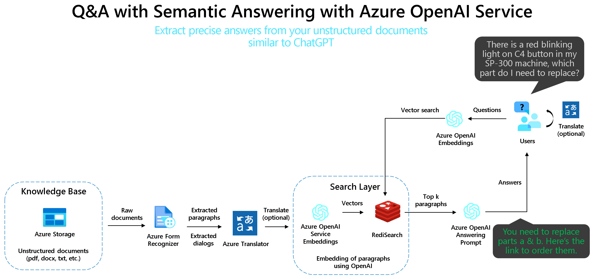

# Azure OpenAI Embeddings QnA

一个支持openai的文档搜索的简单web应用程序。这个repo使用Azure OpenAI服务从文档创建嵌入向量。为了回答用户的问题，它检索最相关的文档，然后使用GPT-3提取与问题匹配的答案。


# 运行此存储库
运行此存储库：
-   [在 Azure 上部署（WebApp + Redis Stack + Batch Processing）](#deploy-on-azure-webapp--redis-stack--batch-processing)
-   [在 Docker 中本地运行所有内容（WebApp + Redis Stack + Batch Processing）](#run-everything-locally-in-docker-webapp--redis-stack--batch-processing)
-   [使用 Conda 在 Python 中本地运行所有内容（仅限 WebApp）](#run-everything-locally-in-python-with-conda-webapp-only)
-   [使用 venv 在 Python 中本地运行所有内容](#run-everything-locally-in-python-with-venv)
-   [针对现有 Redis 部署在 Docker 中本地运行 WebApp）](#run-webapp-locally-in-docker-against-an-existing-redis-deployment)

## 在 Azure 上部署（WebApp + Redis Stack + Batch Processing）
[](https://portal.azure.com/#create/Microsoft.Template/uri/https%3A%2F%2Fraw.githubusercontent.com%2Fruoccofabrizio%2Fazure-open-ai-embeddings-qna%2Fmain%2Finfrastructure%2Fdeployment.json)

单击“部署到 Azure”按钮，然后在 Azure 门户中配置设置，如[环境变量](#环境变量)部分中所述。

请注意，您需要：
-   具有已部署模型的现有OpenAI（指令模型，例如text-davinci-003，以及嵌入模型，例如text-search-davinci-doc-001和text-search-davinci-query-001）
-   现有表单识别器资源（可选 - 如果要从文档中提取文本）
-   现有翻译资源（可选 - 如果要翻译文档）

## 在 Docker 中本地运行所有内容（WebApp + Redis Stack + Batch Processing）

首先，克隆存储库：

```console
git clone https://github.com/ruoccofabrizio/azure-open-ai-embeddings-qna
cd azure-open-ai-embeddings-qna
```

接下来，按照[环境变量](#环境变量):中所述进行配置： `.env` 


```console
cp .env.template .env
vi .env # or use whatever you feel comfortable with
```

最后运行应用程序：

```console
docker compose up
```

在   [http://localhost:8080](http://localhost:8080)打开浏览器

这将启动三个 Docker 容器：
-   网络应用本身
-   用于存储嵌入的 Redis 堆栈
-   批处理 Azure 函数

## 使用 Conda 在 Python 中本地运行所有内容（仅限 WebApp）

这要求 Redis 在某处运行，并期望您已按照上述方式进行设置。在这种情况下，请指向您的 Redis 部署。 `REDIS_ADDRESS` 

您可以通过以下方式运行本地 Redis 实例：
```console
 docker run -p 6379:6379 redis/redis-stack-server:latest
```

您可以通过以下方式运行本地 Redis 实例：
```console
 docker run -p 7071:80 fruocco/oai-batch:latest
```

为 Python 创建环境： `conda` 

```console
conda env create -f code/environment.yml
conda activate openai-qna-env
```

按照 [环境变量](#环境变量)中所述配置您的  `.env` 

运行网络应用：
```console
cd code
streamlit run OpenAI_Queries.py
```

## 使用 venv 在 Python 中本地运行所有内容
这需要Redis在某个地方运行，并期望你已经设置好 `.env` 如上所述。在这种情况下，,  指向 `REDIS_ADDRESS`到你的Redis部署。

您可以通过以下方式运行本地 Redis 实例：
```console
 docker run -p 6379:6379 redis/redis-stack-server:latest
```

可以运行本地批处理 Azure 函数：
```console
 docker run -p 7071:80 fruocco/oai-batch:latest
```

请确保您已安装 Python 3.9+。

创建 `venv`  Python 创建环境：venv

```console
python -m venv .venv
.venv\Scripts\activate
```

安装要求PIP `PIP` 
```console
pip install -r code\requirements.txt
```

按照[环境变量](#环境变量)中所述配置您的 `.env`  

运行网络应用：
```console
cd code
streamlit run OpenAI_Queries.py
```

## 针对现有 Redis 部署在 Docker 中本地运行 WebApp

### 选项 1 - 运行预构建的 Docker 映像

按照 [环境变量](#环境变量)中所述配置您的 `.env`
然后运行：

```console
docker run -e .env -p 8080:80 fruocco/oai-embeddings:latest
```

### 选项 2 - 自己构建 Docker 映像

按照[环境变量](#环境变量)中所述配置您的`.env` 

```console
docker build . -t your_docker_registry/your_docker_image:your_tag
docker run -e .env -p 8080:80 your_docker_registry/your_docker_image:your_tag
```


## 环境变量

以下是参数的说明：

| 以下是参数的说明： | 参数 | 备注 |
| --- | --- | ------------- |
|OPENAI_ENGINES|text-davinci-003|Instruction engines deployed in your Azure OpenAI resource|
|OPENAI_EMBEDDINGS_ENGINE_DOC | text-embedding-ada-002  | Embedding engine for documents deployed in your Azure OpenAI resource|
|OPENAI_EMBEDDINGS_ENGINE_QUERY | text-embedding-ada-002  | Embedding engine for query deployed in your Azure OpenAI resource|
|OPENAI_API_BASE | https://YOUR_AZURE_OPENAI_RESOURCE.openai.azure.com/ | Your Azure OpenAI Resource name. Get it in the [Azure Portal](https://portal.azure.com)|
|OPENAI_API_KEY| YOUR_AZURE_OPENAI_KEY | Your Azure OpenAI API Key. Get it in the [Azure Portal](https://portal.azure.com)|
|REDIS_ADDRESS| api | URL for Redis Stack: "api" for docker compose|
|REDIS_PASSWORD| redis-stack-password | OPTIONAL - Password for your Redis Stack|
|REDIS_ARGS | --requirepass redis-stack-password | OPTIONAL - Password for your Redis Stack|
|CONVERT_ADD_EMBEDDINGS_URL| http://batch/api/BatchStartProcessing | URL for Batch processing Function: "http://batch/api/BatchStartProcessing" for docker compose |
|AzureWebJobsStorage | AZURE_BLOB_STORAGE_CONNECTION_STRING_FOR_AZURE_FUNCTION_EXECUTION | Azure Blob Storage Connection string for Azure Function - Batch Processing |


附加功能的可选参数（例如，使用 OCR 提取文档文本）：

| 应用设置 | 参数 | 备注 |
| --- | --- | ------------- |
|BLOB_ACCOUNT_NAME| YOUR_AZURE_BLOB_STORAGE_ACCOUNT_NAME| OPTIONAL - Get it in the [Azure Portal](https://portal.azure.com) if you want to use the document extraction feature |
|BLOB_ACCOUNT_KEY| YOUR_AZURE_BLOB_STORAGE_ACCOUNT_KEY| OPTIONAL - Get it in the [Azure Portal](https://portal.azure.com)if you want to use document extraction feature|
|BLOB_CONTAINER_NAME| YOUR_AZURE_BLOB_STORAGE_CONTAINER_NAME| OPTIONAL - Get it in the [Azure Portal](https://portal.azure.com) if you want to use document extraction feature|
|FORM_RECOGNIZER_ENDPOINT| YOUR_AZURE_FORM_RECOGNIZER_ENDPOINT| OPTIONAL - Get it in the [Azure Portal](https://portal.azure.com) if you want to use document extraction feature|
|FORM_RECOGNIZER_KEY| YOUR_AZURE_FORM_RECOGNIZER_KEY| OPTIONAL - Get it in the [Azure Portal](https://portal.azure.com) if you want to use document extraction feature|
|PAGES_PER_EMBEDDINGS| Number of pages for embeddings creation. Keep in mind you should have less than 3K token for each embedding.| Default: A new embedding is created every 2 pages.|
|TRANSLATE_ENDPOINT| YOUR_AZURE_TRANSLATE_ENDPOINT| OPTIONAL - Get it in the [Azure Portal](https://portal.azure.com) if you want to use translation feature|
|TRANSLATE_KEY| YOUR_TRANSLATE_KEY| OPTIONAL - Get it in the [Azure Portal](https://portal.azure.com) if you want to use translation feature|
|TRANSLATE_REGION| YOUR_TRANSLATE_REGION| OPTIONAL - Get it in the [Azure Portal](https://portal.azure.com) if you want to use translation feature|
